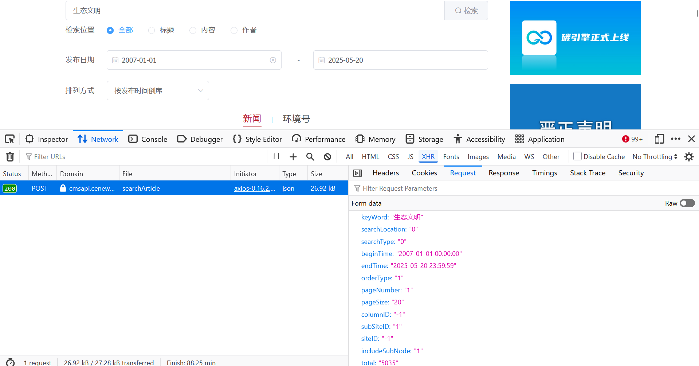

Website Types and Scraping Approaches
======

**Table of Contents**
- [Website Types and Scraping Approaches](#website-types-and-scraping-approaches)
	- [How to Know Which Approach to Use?](#how-to-know-which-approach-to-use)
	- [JSON-based Parsing](#json-based-parsing)
		- [ctrip.com 携程](#ctripcom-携程)
		- [cenews.com.cn 中国环境](#cenewscomcn-中国环境)
		- [people.cn 人民网](#peoplecn-人民网)
	- [URL-based Parsing](#url-based-parsing)
		- [Query String with `?`](#query-string-with-)
			- [weibo.com 微博](#weibocom-微博)
			- [mee.gov.cn 生态环境部](#meegovcn-生态环境部)
		- [Query String without `?`](#query-string-without-)
			- [anjuke.com 安居客](#anjukecom-安居客)

Websites use different content loading mecanisms. Accordingly, there're two types of scraping methods: JSON-based vs. URL-based.

## How to Know Which Approach to Use? 
(Answered by Claude 3.7 Sonnet)

1. Inspect Network Requests
     - Open browser Dev Tools using ``Fn + F12``, go to the `Network` tab
     - On the website, perform a request by applying a filter or navigate to next page
     - On Dev Tools, click `XHR/Fetch` tab to view the corresponding request that returns data
     - Click that request to view details
  
2. Check Response Types
     - Click `Response` to view the response type:
     - If you see JSON responses with the actual data, use the JSON-based parsing
       - If JSON-based, should also click `Request` to inspect the corresponding parameters controlling pagination and filters 
       - See [examples below](#json-based-parsing)
      
     - If you only see HTML documents, use the URL-based parsing
       - See [examples below](#url-based-parsing)

3. Test a Simple Request
     - Try accessing a suspected API endpoint directly
     - If it returns valid JSON with expected data, the JSON-based API approach will work


## JSON-based Parsing
This approach is recommended on modern websites built with AJAX/API infrastructure (React/Vue/Angular), where **pagination and filter changes are not reflected in the URLs**.

Since JSON is already structured data that can be directly processed without HTML parsing, it is strongly recommended when possible. This way we don't have to navigate complex HTML tree any more. 

APIs often provide more complete and consistent data than what's visible on the webpage


### ctrip.com 携程
Ctrip provides both mobile and PC pages, which apply different loading mecanism: ***infinite scrolling*** on mobile version, and ***pagination without URL changes*** on PC version. 

**For 武夷山**

- Mobile
  ````
  https://m.ctrip.com/webapp/you/commentWeb/commentList?businessId=126481&businessType=sight
  ````

- PC
  ````
  https://you.ctrip.com/sight/wuyishan22/126481.html
  ````

Both can be scraped using API requests, but I guess the mobile one allows to load more comments than the PC one that apparently shows only up to `10 * 300 = 3000` comments.

The API entry can be found in Dev Tools' **Network**: `https://m.ctrip.com/restapi/soa2/13444/json/getCommentCollapseList?_fxpcqlniredt=09031109310692966540&x-traceID=09031109310692966540-1747919168810-7858839`. 

Use `https://m.ctrip.com/restapi/soa2/13444/json/getCommentCollapseList` for request.

**Request** (Mobile)  
```
{
	"arg": {
		"channelType": 7,
		"collapseType": 1,
		"commentTagId": 0,
		"pageIndex": 2,
		"pageSize": 10,
		"pageType": 1,
		"poiId": null,
		"resourceId": 126481,
		"resourceType": 11,
		"sortType": 6,
		"sourceType": 1,
		"starType": 0,
		"videoImageSize": "700_392"
	},
	"contentType": "json",
	"head": {
		"auth": "",
		"cid": "09031109310692966540",
		"ctok": "",
		"cver": "1.0",
		"extension": [
			{
				"name": "source",
				"value": "web"
			},
			{
				"name": "technology",
				"value": "H5"
			},
			{
				"name": "os",
				"value": "PC"
			},
			{
				"name": "application",
				"value": ""
			}
		],
		"lang": "01",
		"sid": "8888",
		"syscode": "09",
		"xsid": ""
	}
}
```

**Response** (Mobile, first comment)  
```
{
	"0": {
		"commentId": 207779349,
		"poiInfo": null,
		"userInfo": {
			"userId": 23228959,
			"uid": null,
			"clientAuth": "B8660ADFEB463134FC1D3F250DEFBD30",
			"userNick": "匿名用户",
			"userImage": "https://dimg02.c-ctrip.com/images/1me5m12000babvc40EDFD.png",
			"userMedals": [],
			"userMember": "铂金贵宾",
			"identitiesName": "",
			"userMemberCode": "20",
			"url": "",
			"vIcon": "",
			"identityDesc": "",
			"tag": null,
			"showTagList": null,
			"levelValueIcon": "https://pages.c-ctrip.com/livestream/userpage/ic_level_5.png",
			"urls": {
				"appUrl": null,
				"h5Url": null,
				"wechatUrl": null,
				"mainWechatUrl": null
			}
		},
		"extInfo": {
			"playTime": null,
			"duration": 0,
			"durationType": 0,
			"avgCost": null,
			"airplane": null,
			"seatLevel": null,
			"departure": null,
			"arrival": null
		},
		"replyInfo": [],
		"replyTypeList": null,
		"commentKeywordList": [],
		"commentTagInfo": [],
		"resourceId": 126481,
		"resourceType": 11,
		"businessId": 1834371,
		"businessType": 70,
		"districtId": 22,
		"sourceType": 5,
		"externalResourceId": 1128135034270899,
		"hasVoted": false,
		"isUnUseful": false,
		"showUsefulModule": null,
		"isPicked": false,
		"isGood": false,
		"isOwner": false,
		"fromType": 1,
		"fromTypeText": "来自订单",
		"publishTime": "/Date(1743773025000+0800)/",
		"publishStatus": 6,
		"usefulCount": 0,
		"replyCount": 0,
		"score": {
			"source": "5.0",
			"parsedValue": 5
		},
		"touristType": 2,
		"images": [
			{
				"imageId": 1471448615,
				"height": 2532,
				"width": 1899,
				"imageSrcUrl": "https://dimg04.c-ctrip.com/images/0EQ1e12000jkcs0auEB3E_W_640_10000.jpg?proc=autoorient",
				"imageThumbUrl": "https://dimg04.c-ctrip.com/images/0EQ1e12000jkcs0auEB3E_D_180_180.jpg?proc=autoorient",
				"tagText": null,
				"tagId": null
			},
			{
				"imageId": 1471448624,
				"height": 1899,
				"width": 2532,
				"imageSrcUrl": "https://dimg04.c-ctrip.com/images/0EQ4q12000jkd56tp8EC7_W_640_10000.jpg?proc=autoorient",
				"imageThumbUrl": "https://dimg04.c-ctrip.com/images/0EQ4q12000jkd56tp8EC7_D_180_180.jpg?proc=autoorient",
				"tagText": null,
				"tagId": null
			},
			{
				"imageId": 1471448614,
				"height": 1899,
				"width": 2532,
				"imageSrcUrl": "https://dimg04.c-ctrip.com/images/0EQ6412000jkb9503AEA8_W_640_10000.jpg?proc=autoorient",
				"imageThumbUrl": "https://dimg04.c-ctrip.com/images/0EQ6412000jkb9503AEA8_D_180_180.jpg?proc=autoorient",
				"tagText": null,
				"tagId": null
			},
			{
				"imageId": 1471448623,
				"height": 1899,
				"width": 2532,
				"imageSrcUrl": "https://dimg04.c-ctrip.com/images/0EQ6m12000jkbb8hp116F_W_640_10000.jpg?proc=autoorient",
				"imageThumbUrl": "https://dimg04.c-ctrip.com/images/0EQ6m12000jkbb8hp116F_D_180_180.jpg?proc=autoorient",
				"tagText": null,
				"tagId": null
			},
			{
				"imageId": 1471448613,
				"height": 1899,
				"width": 2532,
				"imageSrcUrl": "https://dimg04.c-ctrip.com/images/0EQ6b12000jkcsrq78EF7_W_640_10000.jpg?proc=autoorient",
				"imageThumbUrl": "https://dimg04.c-ctrip.com/images/0EQ6b12000jkcsrq78EF7_D_180_180.jpg?proc=autoorient",
				"tagText": null,
				"tagId": null
			},
			{
				"imageId": 1471448622,
				"height": 1899,
				"width": 2532,
				"imageSrcUrl": "https://dimg04.c-ctrip.com/images/0EQ4x12000jkd29enA5A0_W_640_10000.jpg?proc=autoorient",
				"imageThumbUrl": "https://dimg04.c-ctrip.com/images/0EQ4x12000jkd29enA5A0_D_180_180.jpg?proc=autoorient",
				"tagText": null,
				"tagId": null
			}
		],
		"videos": [],
		"scores": [
			{
				"logicValue": 1,
				"logicName": null,
				"score": {
					"source": "5.0",
					"parsedValue": 5
				},
				"name": "景色"
			},
			{
				"logicValue": 2,
				"logicName": null,
				"score": {
					"source": "5.0",
					"parsedValue": 5
				},
				"name": "趣味"
			},
			{
				"logicValue": 3,
				"logicName": null,
				"score": {
					"source": "5.0",
					"parsedValue": 5
				},
				"name": "性价比"
			}
		],
		"voteUsers": [],
		"content": "武夷山景色太美了，山清水秀的好风光，建议乘坐竹筏子，一定要提前预约哦。有时间过来建议最好玩两天的，现在不收门票，非常优惠哦。非常推荐。",
		"languageType": "zh-cn",
		"translateContent": null,
		"translateLanguageType": null,
		"canEdit": false,
		"jumpUrl": "/trip_flutter?flutterName=flutter_trip_shoot_review_detail&businessId=207779349",
		"jumpH5Url": "https://m.ctrip.com/webapp/you/comment/detail/126481/11/207779349.html",
		"replyJumpUrl": "/rn_destination_video/main.js?CRNModuleName=destinationlive&CRNType=1&initialPage=CommentFloat&id=207779349&isPresent=0&topPercent=0.3&isTransparentBg=YES&scene=review&topBackgroundColor=rgba(0,0,0,0.6)",
		"publishTypeTag": "2025-04-04 发布点评",
		"isTripShoot": false,
		"aiTagIdSens": null,
		"replyTag": null,
		"replyContent": null,
		"replyTime": null,
		"setTitle": null,
		"outerTitle": null,
		"impressionTags": null,
		"recommendItems": null,
		"childrenTag": null,
		"ipLocatedName": "黑龙江",
		"replyIpLocatedName": null,
		"isFollow": false,
		"isDeleted": false,
		"clientInfo": "{\"clientId\":\"\",\"currency\":\"\",\"platform\":\"\",\"cctPlatform\":\"\"}",
		"ip": null,
		"jumpMiniAppUrl": "/pages/gs/comment/detail?BusinessId=0&BusinessType=0&CommentId=207779349&POIId=0&SightId=0",
		"isAnonym": true,
		"theForkLogoUrl": null,
		"timeDuration": null,
		"touristTypeDisplay": "家庭亲子",
		"originContent": null,
		"collectCnt": 0,
		"hasCollected": false,
		"isUnderReview": null
	}
}
```


### cenews.com.cn 中国环境
<!--  -->

- **Request**
```
{
	"keyWord": "生态文明",
	"searchLocation": "0",
	"searchType": "0",
	"beginTime": "2007-01-01 00:00:00",
	"endTime": "2025-05-22 23:59:59",
	"orderType": "1",
	"pageNumber": "1",
	"pageSize": "20",
	"columnID": "-1",
	"subSiteID": "1",
	"siteID": "-1",
	"includeSubNode": "1",
	"total": "39824"
}
```

  Raw:
```
keyWord=%E7%94%9F%E6%80%81%E6%96%87%E6%98%8E&searchLocation=0&searchType=0&beginTime=2007-01-01%2000%3A00%3A00&endTime=2025-05-22%2023%3A59%3A59&orderType=1&pageNumber=1&pageSize=20&columnID=-1&subSiteID=1&siteID=-1&includeSubNode=1&total=39824
```


- **Response** (first article)
```
{
	"0": {
		"fileID": 1354001,
		"title": "读图丨“首都老兵”牵手青少年探秘水质监测站",
		"highlightTitle": "读图丨“首都老兵”牵手青少年探秘水质监测站",
		"highlightContent": "也在青少年心中播种下<span style='background-color: yellow'>生</span><span style='background-color: yellow'>态</span><span style='background-color: yellow'>文</span><span style='background-color: yellow'>明</span>的种子，为推动生物多样性保护凝聚青春力量",
		"source": "中国环境APP",
		"editor": "程梓桐",
		"author": "周莹",
		"authorID": 0,
		"abstract": "北京西城开展生物多样性日科普志愿活动",
		"publishTime": "2025-05-22 07:30:00",
		"articleType": 1,
		"articleStatus": 1,
		"linkID": 0,
		"keywords": "北京 生物多样性",
		"countClick": 16,
		"countDiscuss": 0,
		"countPraise": 0,
		"pic1": "https://res.cenews.com.cn/data3/1/images/2025/0521/17478390677141604_450x338.jpg",
		"pic2": "",
		"pic3": "",
		"bigPic": 0,
		"articleUrl": "",
		"videoUrl": "",
		"columnID": 167,
		"columnName": "发布厅",
		"srcColumnID": 167,
		"srcColumnName": "发布厅",
		"images": 1,
		"videos": 0,
		"atts": 0,
		"duration": 0
	}
}
```


### people.cn 人民网

- **Request**
```
{
	"endTime": 0,
	"hasContent": true,
	"hasTitle": true,
	"isFuzzy": true,
	"key": "生态文明",
	"limit": 10,
	"page": 1,
	"sortType": 2,
	"startTime": 0,
	"type": 1
}
```
  

- **Response** (first article)
```
{
	"0": {
		"author": "姚禹",
		"belongsName": "理论#经济社会#《思想政治工作研究》#每期精选",
		"belongsId": "[\"40531\",\"49154\",\"168824\",\"168825\"]",
		"content": "在全球治理体系变革的关键时期，中国式现代化的<em>生态</em><em>文明</em>实践展现出独特的制度韧性与创新活力，代表了人类文明进步的发展方向。中国积极投身全球<em>生态</em>环境治理，在推动自身<em>生态</em>文明建设的同时引领全球<em>生态</em>治理的变革、携手世界各国共筑<em>生态</em><em>文明</em>之基，不仅为解决全球性<em>生态</em>难题贡献智慧与方案，更在实践中展现人类文明新形态的魅力。这些举措不仅是技术层面的创新，更承载着深厚的<em>文明</em>底蕴。 中国式现代化以技术普惠理念共谋全球<em>生态</em>文明建设，携手世界各国共筑<em>生态</em><em>文明</em>之基。中国积极帮助沿线国家承建基础设施中贯彻人与自然和谐共生的理念。从承建绿色能源基础设施项目到推广绿色低碳技术，中国式现代化的<em>生态</em>文明建设实践，为世界各<em>文明</em>应对生态环境挑战、建设人与自然和谐共生的现代化提供了经验路径。中国的<em>生态</em>文明建设与全球环境治理实践，展现了中国式现代化的<em>生态</em><em>文明</em>底蕴。",
		"contentOriginal": "<p style=\"text-indent: 2em;\"><span style=\"font-family: '楷体';\"> 阅读提示：“人与自然和谐共生”是马克思主义基本原理同中国具体实际相结合、同中华优秀传统文化相结合的重大成果。中国式现代化的“人与自然和谐共生”这一核心要义，深植于马克思主义生态观与中华优秀传统生态文化的创造性结合，既体现马克思主义“人与自然是生命共同体”的科学论断，又对中华文明“天人合一”哲学体系进行现代转化，是“第二个结合”的生动典范。</span></p> <p style=\"text-indent: 2em;\">党的二十大报告指出：“中国式现代化是人与自然和谐共生的现代化。”这一论断深刻揭示了中国式现代化对西方现代化模式的超越。中国式现代化通过重塑人与自然的辩证关系，批判资本主义对人的异化和对自然的掠夺，从根本上突破了西方现代化以牺牲环境为代价的发展局限。在实践层面，中国摒弃了“先污染后治理”的老路，将生态文明建设纳入“五位一体”总体布局，破解了“增长陷阱”与“生态赤字”的世界性难题，这不仅实现了经济发展与生态保护的协同共进，更为全球生态文明建设贡献了东方智慧，创造出人与自然和谐共生的人类文明新形态。</p> <p style=\"text-indent: 2em;\"><strong>人与自然和谐共生的理论内涵</strong></p> <p style=\"text-indent: 2em;\">“人与自然和谐共生”是马克思主义基本原理同中国具体实际相结合、同中华优秀传统文化相结合的重大成果。中国式现代化在理论上将传统西方工业文明“以增长为核心”的单一逻辑转换为“可持续性”的核心理念，倡导人与自然和谐共生，昭示着人类文明发展的未来。西方现代化模式因深受人类中心主义思维的影响，把人类理解为自然的主宰，将自然客体化为满足资本增殖需求的工具性存在。马克思在《1844年经济学哲学手稿》中指出：“没有自然界，没有感性的外部世界，工人什么也不能创造。”恩格斯提出了“人类与自然的和解以及人类本身的和解”即“两个和解”思想，跳出了人与自然二元对立的传统视角，他还在《自然辩证法》中批判当时蓬勃发展的西方现代化进程：“我们不要过分陶醉于我们人类对自然界的胜利。对于每一次这样的胜利，自然界都对我们进行报复。”以资源过度掠夺为核心的经济发展模式，虽然在短期内推动了生产力的快速增长，却不可避免地引发了生态系统的持续退化，给人类的长期生存带来持久威胁。马克思主义生态观揭示了资本主义体系中自然资源商品化与生态危机之间的内在联系，资本主义生产逻辑通过对自然资源的无节制开发积累剩余价值，长此以往，生态危机便成为内置于资本主义制度的必然产物。马克思主义生态观进一步阐明，唯有超越资本逻辑，摆脱资本对生产和社会发展的绝对主导，才能真正实现人类与自然的协调发展。</p> <p style=\"text-indent: 2em;\">中华民族一向尊重自然、热爱自然，中国式现代化的“人与自然和谐共生”这一核心要义，深植于马克思主义生态观与中华优秀传统生态文化的创造性结合，既体现马克思主义“人与自然是生命共同体”的科学论断，又对中华文明“天人合一”哲学体系进行现代转化，是“第二个结合”的生动典范。中华优秀传统文化中，老子《道德经》“道法自然”的宇宙观、《易经》中“财成天地之道，辅相天地之宜”的系统思维、张载《西铭》中“民胞物与”的伦理观，都强调人与自然的辩证统一、人与自然是一个不可分割的整体，主张人类活动需遵循自然规律以实现共生共荣，在取用自然资源时“取之有时，用之有度”，以实现人与自然的相互滋益。这些思想共同构成了“天人合一”“天人互益”的哲学体系，与马克思主义关于“两个和解”的论述形成历史性呼应。</p> <p style=\"text-indent: 2em;\">面对全球生态危机，中国式现代化摒弃西方现代化的资本逻辑，通过重构生产关系将生态可持续性嵌入经济体系，以“绿水青山就是金山银山”的辩证思维推动绿色发展，既破解了经济增长与生态环境保护的对立，又为全球可持续发展贡献了中国方案。</p> <p style=\"text-indent: 2em;\"><strong>推进人与自然和谐共生的现代化实践探索</strong></p> <p style=\"text-indent: 2em;\">党的十八大以来，我国生态环境保护发生历史性、转折性、全局性变化，生态文明建设取得举世瞩目成就。在全球治理体系变革的关键时期，中国式现代化的生态文明实践展现出独特的制度韧性与创新活力，代表了人类文明进步的发展方向。</p> <p style=\"text-indent: 2em;\">在西方现代化路径中，工业化与城市化的高速发展虽然极大地推动了经济增长，但往往以资源过度消耗与生态环境严重破坏为代价，形成了所谓的“增长陷阱”。这一模式虽然在历史上为少数发达国家带来了繁荣，却是以牺牲本国的生态环境为代价。欧美发达国家在现代化进程中掠夺性开发大量自然资源，致使一些地区的资源濒临枯竭，出现“生态赤字”，片面追求经济效益，肆意排放工业污染物，引发严重的雾霾、酸雨等环境灾难。随着世界全球化进程的加快，他们又将劳动密集型产业和高能耗专业转移至发展中国家，使众多发展中国家长期承担着环境污染与资源枯竭的风险。这种西方现代化模式把生态危机推向全球的同时，加剧了国际生态不平等。</p> <p style=\"text-indent: 2em;\">中国式现代化并非对西方现代化模式的简单模仿，而是在马克思主义生态观指导下，继承中华传统生态智慧，结合中国国情进行的系统性制度创新。中国式现代化探索人与自然和谐共生之路，促进经济发展与生态保护协调统一，其理论逻辑在于以生态可持续性为发展基础，通过优化经济结构和调整产业布局，打破传统现代化路径中经济增长与环境保护之间的对立关系，推动发展方式的绿色低碳转型。</p> <p style=\"text-indent: 2em;\">在生态文明建设的实践路径上，中国式现代化展现出多维度协同推进的系统性特征。绿色低碳技术创新领域已形成全要素联动的创新生态，中国通过大力推动技术创新与能源结构转型，构建起光伏发电、特高压输电、大规模储能等领域的完整产业链，正从高碳经济向低碳经济全面过渡，并已成为全球最大的可再生能源市场和设备制造国，在风能、太阳能及储能技术等领域的研发和应用中居于世界领先地位。在数字技术赋能生态治理方面取得突破，中国通过构建智慧监管平台和数字化执法体系实现环境治理精准化。生态保护工程突出系统性思维，将山水林田湖草沙视为生命共同体，创新“自然恢复为主、人工修复为辅”的治理范式，通过生态廊道建设和生物栖息地修复工程增强生态系统韧性，这种理念与中国古代“万物并育而不相害”的思想一脉相承，打破了西方单一要素治理的思维定式。在民生维度创新生态价值转化机制，从2021年中共中央办公厅、国务院办公厅印发的《关于建立健全生态产品价值实现机制的意见》，到2022年地方层面《上海市碳普惠体系建设工作方案》等政策纷纷落地，党和国家致力于将生态产品价值纳入公共服务体系，使生态改善成果切实转化为民众的获得感，使人民享有更普惠的民生福祉。</p> <p style=\"text-indent: 2em;\"><strong>以共谋全球生态文明建设创造人类文明新形态</strong></p> <p style=\"text-indent: 2em;\">保持良好的生态环境是全世界人民的共同心愿。中国积极投身全球生态环境治理，在推动自身生态文明建设的同时引领全球生态治理的变革、携手世界各国共筑生态文明之基，不仅为解决全球性生态难题贡献智慧与方案，更在实践中展现人类文明新形态的魅力。</p> <p style=\"text-indent: 2em;\">中国积极参与和推动建设全球生态环境治理框架。在全球治理的广阔舞台上，中国传承“天人合一”“协和万邦”的传统价值理念，主导建立绿色发展国际联盟，并以南南合作框架支持发展中国家减排实践，实现从全球生态治理的参与者到引领者的转变。这一实践体系深度融合技术创新、制度重构与全球协作，既破解了资本主义技术异化的生态困境，也为人类可持续发展贡献了包含标准体系与政策工具的中国方案。中国不只是授人以鱼，还能授人以渔；不仅提供“一站式”的技术服务，还提供后期技术人员的培训，帮助发展中国家实现从被动减排到主动转型的能力跃升。这套治理体系的理论价值在于突破西方殖民主义逻辑，以“共同但有区别的责任”原则重构全球生态治理话语体系，形成技术标准互认、环境政策协同、发展权益共享的新型国际合作模式。</p> <p style=\"text-indent: 2em;\">中国式现代化的生态文明建设实践，以马克思主义基本原理为理论指引，重新定义技术与社会的关系。马克思主义关于现代技术的批判由来已久，深刻揭示了资本主义社会中技术与资本合谋所带来的异化问题。在资本逻辑的框架下，技术成为资本积累的工具，背离了服务人类解放的初衷。中国式现代化的全球生态文明建设以技术普惠为核心，致力于打破资本主义科技体系技术异化的逻辑，使技术重新回归服务于社会福祉与公共利益的本源。依托马克思主义技术批判理论对资本主义技术异化的超越，中国在绿色技术领域实现系统性突破，构建了以社会效益为导向的可再生能源创新体系。中国式现代化正引领世界在通往“绿色科技平权”的道路上大步前进，建立碳中和科技创新联合体，推动核心绿色技术开源共享；完善基于“共同但有区别的责任”的技术转移体系，强化世界贸易组织框架下的绿色专利保护规则；深化数字赋能，通过全球可持续发展大数据平台实现环境治理技术协同创新。这些举措不仅是技术层面的创新，更承载着深厚的文明底蕴。</p> <p style=\"text-indent: 2em;\">中国式现代化以技术普惠理念共谋全球生态文明建设，携手世界各国共筑生态文明之基。中国积极帮助沿线国家承建基础设施中贯彻人与自然和谐共生的理念。共建“一带一路”倡议提出后，首条以中方为主投资建设、全线采用中国技术标准、使用中国设备的国际铁路中老铁路项目，集成生态廊道监测与智能建造技术，自勘察设计开始注重维系沿线生态平衡和生物多样性，实现了交通动脉与生物多样性保护的协同；中国在非洲承建的埃塞俄比亚阿伊萨二期风电项目注重本土化能力培育，以技术转移带动区域产业链的整体升级；中国还致力于重构全球绿色基础设施标准，凭借建设跨国环保科技联合实验室打破西方发达国家对于环保技术的垄断，以及实施“绿色丝路使者计划”来帮助共建国家培养绿色专业技术人才。根据中国国家知识产权局2023年统计数据显示，中国是全球绿色低碳技术创新的重要贡献者，2016—2022年，全球绿色低碳技术发明专利授权量累计达55.8万件，其中中国专利权人获得授权17.8万件，占比达31.9%。从承建绿色能源基础设施项目到推广绿色低碳技术，中国式现代化的生态文明建设实践，为世界各文明应对生态环境挑战、建设人与自然和谐共生的现代化提供了经验路径。</p> <p style=\"text-indent: 2em;\">中国式现代化通过重构人与自然的辩证关系，克服了西方现代化“人类中心主义”的局限性，将生态价值内嵌到社会发展的内核，这一理念既是对马克思主义“两个和解”的实践回应，也是中华优秀传统文化中“天人合一”思想的当代延续。中国的生态文明建设与全球环境治理实践，展现了中国式现代化的生态文明底蕴。</p> <p style=\"text-indent: 2em;\">（作者系闽南师范大学马克思主义学院副教授，马克思主义学院吴学兵教授对本文进行了指导；本文系习近平文化思想研究中心重大课题“中国式现代化的文明底蕴研究”研究成果，项目编号为：24&WZD15）</p> <p style=\"text-indent: 2em;\">（原文来源：思想政治工作研究）</p>",
		"displayTime": 1747816494000,
		"domain": null,
		"editor": "刘圆圆",
		"hasImg": 0,
		"hasVideo": 0,
		"id": 1000040484840,
		"imageUrl": null,
		"inputTime": 1747816495000,
		"isDisclosed": null,
		"isElited": null,
		"isFixed": null,
		"isOfficial": null,
		"isRecommend": null,
		"keyword": null,
		"newsJson": null,
		"originNodeRname": "中国共产党新闻网#理论",
		"originUrl": "http://article.xuexi.cn/articles/index.html?art_id=9514773526135985738&item_id=9514773526135985738&study_style_id=feeds_default&pid=&ptype=-1&source=share&share_to=wx_single",
		"originalName": null,
		"originalType": null,
		"pretitle": "",
		"shorttitle": "",
		"source": 1,
		"sourceId": 40484840,
		"contentId": 40484840,
		"sourcetitle": "中国式现代化的生态文明底蕴",
		"sourceType": 1,
		"subtitle": "",
		"title": "中国式现代化的<em>生态</em><em>文明</em>底蕴",
		"url": "http://theory.people.com.cn/n1/2025/0521/c40531-40484840.html",
		"originName": ""
	}
}
```
  

## URL-based Parsing
This approach is used on traditional websites, where pagination and filter applications will be marked somewhere in the URL in some way.

### Query String with `?`
A typical and comprehensible way is using
**query string** with `?`, followed by optional `key=value` pairs (filters).  

For some, like [**Weibo**](#weibocom-微博), the queried URL could be the same as the one shown in browser's search bar. 

But for others, e.g. [**MEE**](#meegovcn-生态环境部), the queries URL could be hidden in the **Network** details in Dev Tools.

#### weibo.com 微博 


```
# 关键词+原创+含图片+设定日期范围
https://s.weibo.com/weibo?q=生态文明&scope=ori&haspic=1&timescope=custom:2025-05-01-0:2025-05-21-0&Refer=g

# 关键词+全部+含图片+设定日期范围
https://s.weibo.com/weibo?q=生态文明&typeall=1&haspic=1&timescope=custom:2025-05-01-0:2025-05-21-0&Refer=g

# 话题+全部+全部+设定日期范围
https://s.weibo.com/weibo?q=#生态文明#&typeall=1&suball=1&timescope=custom:2025-05-01-0:2025-05-21-0&Refer=g
```

```
q:              生态文明
typeall:        1 (default)
scope:          ori (original 原创)
haspic:         1 (has picture=True)
timescope:      custom:2025-05-01-0:2025-05-21-0
Refer:          g (not sure what it means)
```


#### mee.gov.cn 生态环境部


```
https://www.mee.gov.cn/was5/web/search?channelid=270514&searchword=&page=1&orderby=-docreltime&searchscope=&timestart=2008.01.01&timeend=2025.05.21&period=&chnls=11&andsen=&total=生态文明&orsen=&exclude=

channelid:      270514
searchword:	
page:           1
orderby:        -docreltime
searchscope:
timestart:      2008.01.01
timeend:        2025.05.21
period:     	
chnls:          11
andsen:         
total:          生态文明
orsen:      
exclude:    
```


### Query String without `?`
Another way is more obscure and, at least in Chinese context, more arbitrary.

#### anjuke.com 安居客
```
https://zh.zu.anjuke.com/fangyuan/gaoxinququ-q-tangjiawan/zj204-fx1-x1-tw2-tj1-dtf1-lx1/

zh:         珠海
zu:         租 (apartments for rental)
gaoxinququ: 区 = 高新区
tangjiawan: 镇 = 唐家湾
zj204:      租金在 1000-1500 之间 (4th place)
fx1:        房型 = 一室 (1st place)
x1:         出租类型 = 整租 (1st place)
tw2:        朝向 = 朝南 (towards) (2nd place)
tj1:        展示被推荐的房源 = True (show recommended ones)
dtf1:       电梯房 = True
lx1:        房屋类型 = 普通住宅 (1st place)
```


